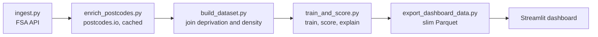

# Food Hygiene Inspection Prioritisation (London)

Ranking London's 81,572 food businesses by their risk of failing a hygiene inspection, so councils can send inspectors to the riskiest places first.

**Live dashboard:** https://london-food-hygiene-risk.streamlit.app/

Pick a borough and a model, and the dashboard shows a ranked inspection list, a map of the top 20%, the reasons each business ranks where it does, and a CSV download for fieldwork.

---

## The problem

London councils cannot inspect every food business on schedule. 7,457 businesses in this snapshot have never been inspected at all. If an inspector can only visit one business in five, which one should they visit?

I built a model that answers that question using only information a council has *before* an inspection, and I tested it the way a council would use it: one borough at a time.

## Results

Measured on a locked test set of 14,278 businesses (801 of them failing) that no model or decision touched until the very end:

| Approach | Failures found in top 20% | Failures found in top 10% |
|---|---|---|
| Random order | 19% | 8% |
| Rank by business type only | 33% | 17% |
| **Final model (logistic regression)** | **39%** | **23%** |

In plain numbers: 2,868 model-guided inspections find **315** failing businesses. The same number of random inspections would find about **160**. Roughly 1 in 9 inspections finds a problem, against 1 in 18 at random.

A failure means a rating of 0, 1 or 2 ("improvement necessary" or worse). All metrics are computed within each borough and then averaged, because a council only ranks its own businesses.

## Data and pipeline

| Source | What it adds |
|---|---|
| [FSA Food Hygiene Rating Scheme API](https://api.ratings.food.gov.uk/help) | Every London food business, its type, location and current rating |
| [postcodes.io](https://postcodes.io) | Postcode to 2021 LSOA (small area) and backup coordinates |
| [English Indices of Deprivation 2025](https://deprivation.communities.gov.uk/download-all) | Deprivation ranks for each small area (overall plus 7 domains) |
| [Census 2021, table TS006](https://www.nomisweb.co.uk/sources/census_2021_bulk) | Population density for each small area |



97.5% of full postcodes matched to an area. Businesses with a withheld or partial address get the average of their postcode district, and the few with no postcode get their borough average, so every business has area features. The averages use only area statistics, never ratings, so no business's own rating can leak into its features.

## What the data showed

Before modelling I asked five questions of the data. Several answers surprised me.

**Withheld addresses fail far less, not more.** I expected home-based businesses to be riskier. They fail at 1.3% against 6.1% for businesses with a full address. Even after adjusting for business type they fail about a third as often (ratio 0.36). A "restaurant" with a withheld address is usually a home kitchen, which the FSA category hides and the withheld flag reveals.

**The riskiest category is small shops, not restaurants.** "Retailers - other" (grocers, off-licences, butchers) fail at 9.1%, schools at 0.9%. Restaurants have an average rate but, because there are so many of them, the most failures in total.

**Boroughs differ 15-fold, and business mix explains almost none of it.** Raw fail rates run from 14.2% in Newham to 0.9% in Kensington and Chelsea. Adjusting for each borough's mix of business types (indirect standardisation) barely changes this: Ealing fails 2.5 times more than its mix predicts, Kensington and Chelsea one sixth as often. Much of this looks like differences in council practice, which is why rankings are only ever made within a borough.

**Deprivation matters, but the London-wide view exaggerates it.** Across London, fail rates fall from 10.6% in the most deprived areas to 1.8% in the least. Within boroughs the gradient survives but is much gentler (7.6% to 4.5%), because the strictest councils also happen to be deprived. Confounding ran the other way for living environment, whose effect only appeared within boroughs.

**Chains fail at well under half the rate of similar independents.** I built a chain-size feature from business names (normalising "Pret A Manger Ltd" and "PRET A MANGER" to the same brand). Businesses with 5 or more London locations fail at 0.41 times the rate their type predicts. Groups of 2 to 4 behave like independents.

## How I built and judged the model

- **An honest baseline.** Ranking by business type alone is what a council could do with a spreadsheet. The model had to beat that, not just random order.
- **Leakage kept out.** The rating's sub-scores, the rating date and the rating key (which contains the rating in its text) are all produced by the inspection itself, so none of them are features.
- **Cross-validation over single splits.** On one validation split, LightGBM looked 0.02 better than logistic regression. Five-fold cross-validation showed them tied (two wins each and one draw).
- **Decision rules set before looking.** Before tuning LightGBM with Optuna I wrote down that it would replace logistic regression only if it won on at least 4 of 5 folds. I tuned on one set of folds and compared on a fresh set, to avoid rewarding settings that happened to suit the tuning folds. It won 2 of 5, so logistic regression stayed. Tuning added only 0.01, which suggests the limit is the information in the features rather than the algorithm.
- **Test set used once.** The final numbers above came from a single scoring of the locked test set. They sit within a couple of points of the cross-validation estimates, so there is no sign of overfitting.
- **Reproducible.** Every source of randomness is seeded. Re-running the notebooks gives identical numbers.

The model's learned effects agree with the analysis above, and go further in two places. Supermarkets look safe in raw rates only because they are chains; once chain size is in the model, the supermarket label itself is slightly above average risk. Mobile caterers look safe because most work from home; with a listed address they are average.

## Fairness

I checked where the model would actually send inspectors, splitting each borough's businesses into fifths by deprivation.

| Fifth of each borough | Share of failures | Inspections (standard model) | Inspections (without deprivation) |
|---|---|---|---|
| Most deprived | 29.0% | **43.5%** | 29.5% |
| 2 | 21.2% | 28.1% | 22.7% |
| 3 | 19.7% | 15.5% | 16.5% |
| 4 | 15.9% | 10.0% | 16.7% |
| Least deprived | 14.2% | **2.9%** | 14.7% |

The standard model over-targets deprived neighbourhoods. The least deprived fifth holds one in seven failing businesses, yet gets 2.9% of inspections, and only 6.1% of its failures are found. Taking the top 20% of a list turns a 2-fold difference in failure rates into a 15-fold difference in inspections.

Removing the deprivation features makes inspections track failures almost exactly. On the test set the accuracy cost looked tiny (0.004), so I recommended switching. I had set a rule to confirm that with cross-validation first, and it showed a real cost of 0.024, lower on all 10 folds. My recommendation failed its own check.

That leaves a policy trade-off (about 6% fewer failures found, against proportional coverage of every neighbourhood) rather than a technical question, and a council should make it. The dashboard therefore uses the standard model by default and offers the alternative as a toggle, with the trade-off stated next to it.

One limit applies to both models: failures are recorded by human inspectors, so any bias in how areas are rated is learned by the model and cannot be measured from this data.

## Limitations and next steps

- **Coarse categories.** "Retailers - other" puts grocers and butchers alongside pharmacies and a toy library, both of which appear near the top of Westminster's list. Keyword features from business names ("butcher", "chemist", "library") are the clearest next improvement.
- **One snapshot.** The FSA API only gives current ratings. Pulling a second snapshot a few months later would show which businesses were re-inspected and allow validation on genuinely future inspections.
- **Scores are for ranking only.** Class weighting pushes predicted probabilities up, so the dashboard shows ranks and percentiles rather than a "chance of failing". Calibration would be needed before showing probabilities.
- **Top of the list.** LightGBM showed a small but steady edge in the top 10%. If councils' real capacity is nearer 10% than 20%, that deserves its own pre-registered test.
- **Chain detection** misses national chains with few London outlets and does not separate franchises from company-run chains.

## Reproduce it

```bash
python -m venv .venv
.venv\Scripts\activate            # Windows (source .venv/bin/activate on Mac/Linux)
pip install -r requirements.txt

python src/ingest.py              # FSA API -> data/raw/
python src/enrich_postcodes.py    # postcodes.io -> data/external/postcode_lookup.csv
```

Then download two files into `data/external/`:
- IoD2025 "File 2: Domains of Deprivation" (CSV), saved as `iod2025_domains.csv`
- Census 2021 TS006 LSOA file (`census2021-ts006-lsoa.csv`), saved as `ts006_population_density_lsoa.csv`

```bash
python src/build_dataset.py           # join everything -> data/processed/
python src/train_and_score.py         # train final models, score every business
python src/export_dashboard_data.py   # slim copy for the dashboard
streamlit run app/streamlit_app.py
```

The notebooks in `notebooks/` (01 to 07) contain the exploration, EDA, model comparison, tuning, final evaluation and fairness analysis in order.

## Repository structure

```
food-hygiene-risk-london/
├── app/
│   ├── streamlit_app.py          dashboard
│   ├── requirements.txt          slim requirements for Streamlit Cloud
│   └── data/scored.parquet       scored businesses (public data only)
├── notebooks/
│   ├── 01_api_exploration.ipynb
│   ├── 02_postcode_exploration.ipynb
│   ├── 03_area_data_exploration.ipynb
│   ├── 04_eda.ipynb
│   ├── 05_baselines.ipynb
│   ├── 06_tuning.ipynb
│   └── 07_final_evaluation.ipynb
├── src/
│   ├── ingest.py                 download FSA data
│   ├── enrich_postcodes.py       postcode lookup with caching
│   ├── build_dataset.py          area joins with fallbacks
│   ├── features.py               feature list, target, fixed split
│   ├── evaluate.py               within-borough metrics
│   ├── models.py                 model definitions
│   ├── train_and_score.py        final training, scoring and explanations
│   └── export_dashboard_data.py  dashboard data export
├── models/lgbm_best_params.json  Optuna result (model binaries are not committed)
└── requirements.txt
```

## Data sources and licences

- Food hygiene ratings: Food Standards Agency, [Open Government Licence v3.0](https://www.nationalarchives.gov.uk/doc/open-government-licence/version/3/)
- English Indices of Deprivation 2025: Ministry of Housing, Communities and Local Government, Open Government Licence v3.0
- Census 2021 population density (TS006): Office for National Statistics, Open Government Licence v3.0
- Postcode lookups: [postcodes.io](https://postcodes.io), built on ONS and Ordnance Survey open data

Contains public sector information licensed under the Open Government Licence v3.0.